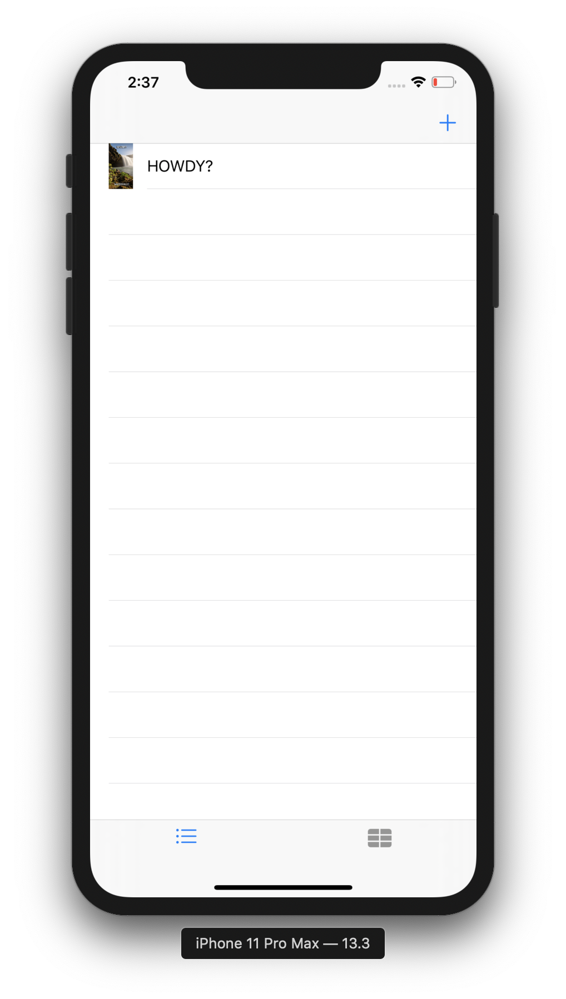
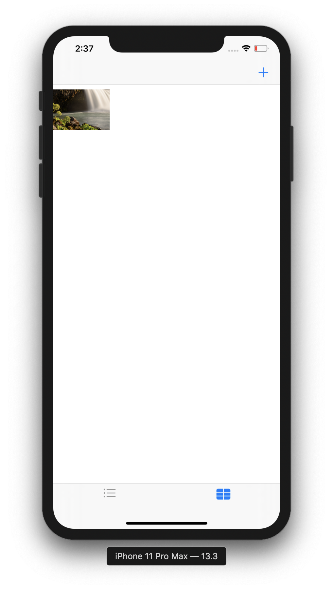
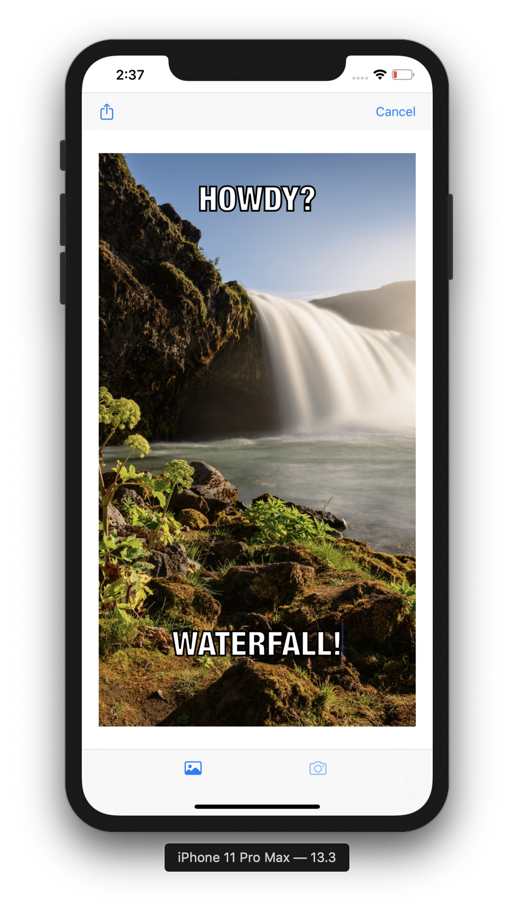

# MemeMe (iOS Nanodegree)

MemeMe is an app that enables a user to take a picture, and add text at the top and bottom to form a meme, and share that meme on Facebook and Twitter and also by SMS or email.Sent memes will appear in a tab view with two tabs: a table view and a collection view.

The app consists of 3 View Controllers:

- Table View Controller:

  

- Collection View Controller:

  

- Meme Creation View Controller:

  

## Dependencies:
- Apple UIKit
